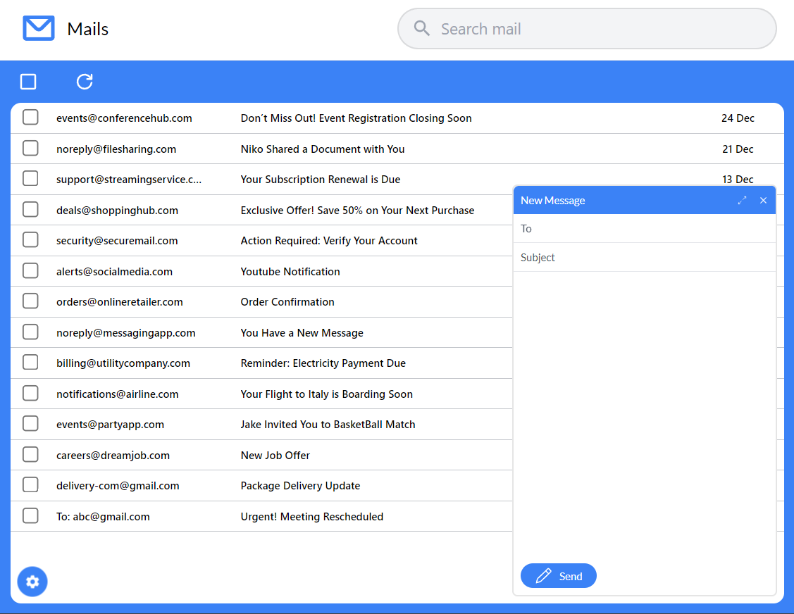

# Gmail Clone



## Technologies:

- `Firebase`
- `Framer Motion`
- `React Router`
- `Typescript`
- `React`
- `Tailwind CSS`
- `Vite`

## How to run:

- Clone this Repository using git command-line on your system.

  ```
  git clone https://github.com/DevanshBhavsar3/gmail-clone.git
  ```

- Open the project folder

  ```
  cd gmail-clone
  ```

- Install all the dependencies

  ```
  npm i
  ```

- Go to [Firebase](https://console.firebase.google.com/) and Create a Project and Add a new Web App.

- Next, copy Firebase SDK configurations.

- Then paste it here:

  ```
  gmail-clone > src > context > firebase.tsx

  ...

  // Paste Your web app's Firebase configuration here

  // It should look something like these:
  // const firebaseConfig = {
  // apiKey: "",
  // authDomain: "",
  // projectId: "",
  // storageBucket: "",
  // messagingSenderId: "",
  // appId: "",
  // };

  const app = initializeApp(firebaseConfig);

  const auth = getAuth(app);
  const db = getFirestore(app);

  ...
  ```

- Turn on Authentication by Email/Password and Google.

  

- Next go to Firestore Database and Create a Database.

  

- Finally, run the project by using,

  ```
  npm run dev
  ```

  and open up [this link](http://localhost:5173).
